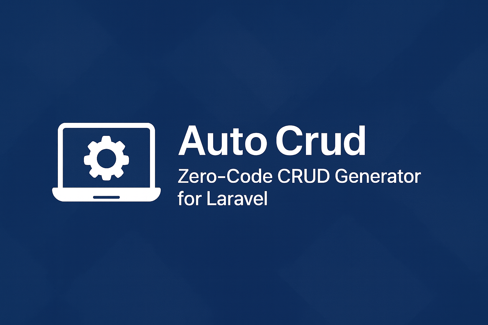

# Auto Crud – Zero-Code CRUD Generator for Laravel



**Auto Crud** is a Laravel package that gives you fully functional CRUD for both **API** and **Web** routes — **with just an empty controller**.

No routes file changes.  
No repetitive controller methods.  
No resource classes required (but supported).  
Just extend one class → instant CRUD.

---

## Features

- 100% automatic CRUD (index, show, store, update, destroy)
- JSON:API responses (via `chriskelemba/jsonapi-response`)
- Soft delete support (trashed, restore, force-delete)
- Built-in file management (single + multiple upload, download, replace)
- Automatic model & resource detection using naming conventions
- Laravel Resource class integration (if exists)
- Works with standard `app/Http/Controllers` and modular structure (`app/Modules/*`)
- Automatic route registration under **/api** and/or **web** routes
- Validation rules, eager loading, ordering — all customizable with protected properties

---

## Installation

```bash
composer require chriskelemba/api-auto-crud
```

This package uses `chriskelemba/jsonapi-response` for API responses.

---

## Usage

All you require to do is to extend the package's controller file.

```php
<?php

namespace App\Http\Controllers;

use AutoCrud\Http\Controllers\Controller;

class UserController extends Controller
{
    //
}
```

---

## Auto-Generated CRUD Routes
For every controller that extends `AutoCrud\Http\Controllers\Controller`, the package automatically registers a full CRUD route set under the **API** prefix, and optionally under **Web** routes.

Assuming a controller named:

```php
<?php

namespace App\Http\Controllers;

use AutoCrud\Http\Controllers\Controller;

class UserController extends Controller
{
    //
}
```

The base API route becomes:

```bash
/api/users
```

Below are the complete routing tables generated for every auto-CRUD controller:

```md
## Standard CRUD Routes
| Method | URI                | Action  | Route Name     |
|--------|---------------------|----------|-----------------|
| GET    | /api/users          | index    | users.index     |
| POST   | /api/users          | store    | users.store     |
| GET    | /api/users/{id}     | show     | users.show      |
| PUT    | /api/users/{id}     | update   | users.update    |
| DELETE | /api/users/{id}     | destroy  | users.destroy   |

## Soft Delete Routes
(Only active if the model uses SoftDeletes)
| Method | URI                          | Action       | Route Name        |
|--------|-------------------------------|--------------|--------------------|
| GET    | /api/users/trashed           | trashed      | users.trashed      |
| POST   | /api/users/{id}/restore      | restore      | users.restore      |
| DELETE | /api/users/{id}/force        | forceDelete  | users.forceDelete  |

## File Handling Routes
| Method | URI                               | Action             | Route Name             |
|--------|------------------------------------|---------------------|-------------------------|
| POST   | /api/users/upload                  | uploadFile         | users.upload            |
| POST   | /api/users/{id}/upload             | updateFile         | users.updateFile        |
| POST   | /api/users/uploads/multiple        | uploadMultiple     | users.uploadMultiple    |
| GET    | /api/users/download/{id}           | downloadFile       | users.download          |
| DELETE | /api/users/delete-file/{id}        | users.deleteFile   | deleteFile              |
```

### Web Routes (optional)
If you enable web routes, the same endpoints are registered under the web prefix:

```bash
/users
```

The route names are prefixed with `web.` by default:

```md
| Method | URI                | Action  | Route Name     |
|--------|---------------------|----------|-----------------|
| GET    | /users              | index    | web.users.index |
| POST   | /users              | store    | web.users.store |
| GET    | /users/{id}         | show     | web.users.show  |
| PUT    | /users/{id}         | update   | web.users.update|
| DELETE | /users/{id}         | destroy  | web.users.destroy|
```

>⚠️ **Model Requirement**
>
>This package requires every controller to be provided with a model.
>If the model is not defined, the controller cannot perform CRUD, soft delete, or file handling operations.
>Make sure your configuration specifies the model used by each controller.

---

## JSON:API Responses

API responses are formatted using `chriskelemba/jsonapi-response`:
- top-level `data`, `links`, `meta`, `jsonapi`
- relationships are included when loaded
- `?include=` can be used to load and include relations

Example:

```
GET /api/users?include=roles
```

---

## Configuration (via .env)

You can configure AutoCrud using environment variables (no config publish required):

### Example .env

```
AUTOCRUD_API_ENABLED=true
AUTOCRUD_API_PREFIX=api
AUTOCRUD_API_ROUTE_PREFIX=
AUTOCRUD_API_PER_PAGE=15

AUTOCRUD_WEB_ENABLED=false
AUTOCRUD_WEB_PREFIX=
AUTOCRUD_WEB_ROUTE_PREFIX=web.
```

> Optional: you can still publish the config if you want to hard‑code settings:
>
> ```bash
> php artisan vendor:publish --tag=autocrud-config
> ```

## Requirements

- Laravel 12
- PHP 8.2+

## Contributing

Contributions are open to everyone.  
Feel free to submit issues, feature requests, or pull requests.

## License

This package is open-source software licensed under the MIT License.
